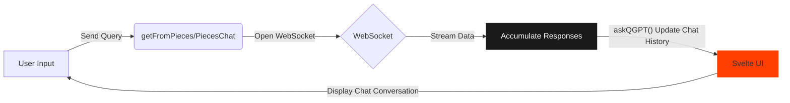
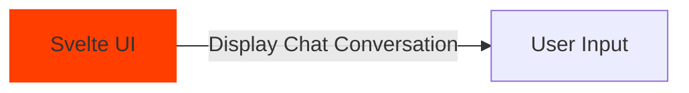
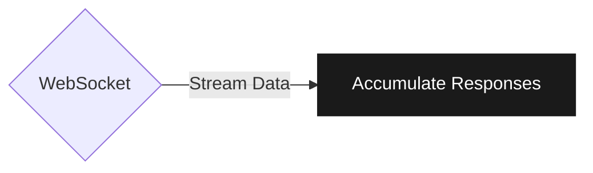
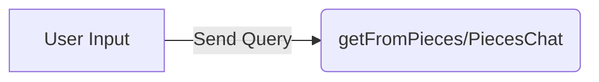

# Pieces x Svelte

[](https://docs.pieces.app/build)

Pieces x Svelte is seamless multi-LLM AI chat integration with Svelte. Everything below is to help you get started quickly.

## Quick Start Guide


## Installation



### Option 1 - Svelte and Kit

Use the Svelte CLI to create a Sveltekit app from scratch. Installing Sveltekit means installer the router - it'll handle your routing if you're planning on building more page routes.

```bash
# create a new project in yourappname directory
npx sv create youappname
cd yourappname
```
### Option 2 - Pure Svelte (No Kit)

Don't need the bulk of Sveltekit thrown in? Planning on using your own router? Use Vite's CLI installer and select "Svelte" from the options list to install pure Svelte.

```bash
(p)npm vite create@latest
```

### Install Dependencies

Your project will definitely need:

1. The Pieces OS Typescript SDK library
2. Websocket types



These are your core tools for carrying queries to your locally-installed Pieces OS server; the server will act as the proxy between your Svelte app and the LLMs your app sends messages to in each session.

If you clone the repo as is then the client-side `askQGPT()` accumulator function is the "CPU" of this entire app. And the Pieces QGPT API is the most essential of server-side endpoints.

Half the battle is setting up your Websocket so that it behaves in a well-defined way, so definitely import the types needed.

```bash

(p)npm install -D @pieces.app/pieces-os-client && @types/ws

```

Then run `(p)npm install` a second time to make sure all your transitive dependencies (from setting up the app) are correctly installed. After that, you can run your development server straight away and just get straight to coding.

```bash

(p)npm run dev

```

## Optional Enhancements - ShadCN and Tailwind

Svelte has a comparatively smaller ecosystem if you're coming from a framework like React, so you may be stuck fishing around for UI component libraries. ShadCN-Svelte is well maintained and updated for Svelte 5 support.

You can [find the ShadCN installation documentation at this link](https://www.shadcn-svelte.com/docs/installation).

I also chose to install Tailwind. However, since Tailwind 4's release I'm not going to point you in either direction here. Currently, if you clone the repo as is then it's using Tailwind 3.

These are entirely optional.

Remember: Vanilla JS and vanilla CSS in your Svelte components is an equally sound option.

## Extending the Pieces API Layer



Look in the `getFromPieces` folder for ideas on how to get started extending the code and implement fun features of your own.

I'm not crazy about talking patterns, but just a heads up that you're going to be using the **Functional Reactive Pattern (FRP)** a lot. The benefits of building this way:

**1. Streaming:** We typically want our AI chats to stream like someone human is responding to us from across the void; thankfully streaming props are baked into the Pieces endpoints.

**2. The Iterable Property**: This is how you dunk your hand into the stream and shape it into the chat shapes you need to return to your client. Get used to seeing and accessing the `iterable` property a lot - it's brimming with data and it saves on lines of code.

## Get Started On Open-Source Contribution

There are A LOT of Pieces endpoints, properties and methods to choose from and it can easily be overwhelming.

Turn that overwhelm into early contribution opportunities, where you can really make an impact on the Pieces for Developers OSS community:

1. Creating issues to help the [Pieces API documentation](https://github.com/pieces-app/documentation) get as intuitive as possible.
2. Testing API endpoints and properties to suggest where the API schema can be optimised.

If you get lost or need help please feel free to get in touch and/or clone this project or look at the [Pieces CLI repo linked here](https://github.com/pieces-app/cli-agent) for working examples.

## Preview, Build and Deploy

To create a production version of your Svelte app, you can preview the production build

```bash

(p)npm run preview


```

If and when you're ready to deploy your app to the web:

```bash

(p)npm run build

```
